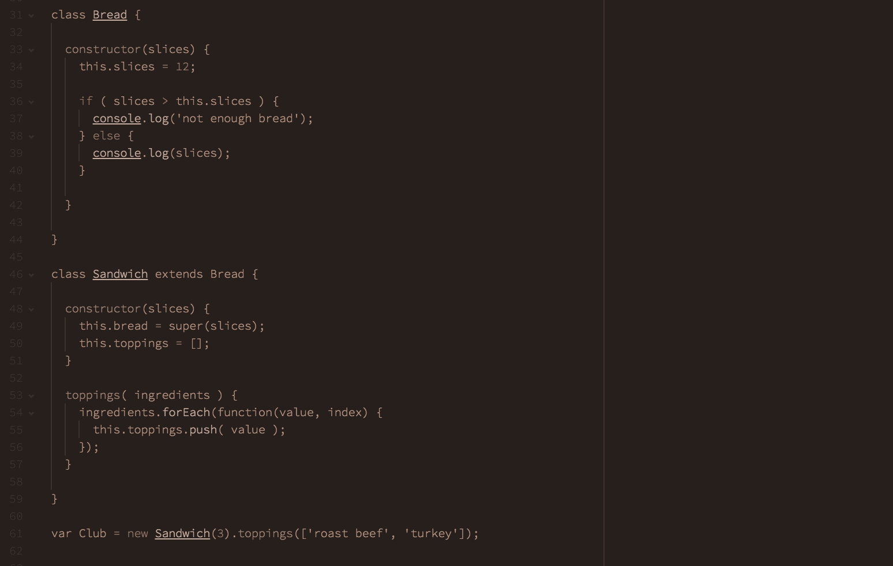

# minim-syntax theme

A simple, monotone syntax theme for Atom.

# Installing

Install via `apm` or the Atom UI:

* Installing via `apm`: run  `apm install minim-syntax`
* Installing via Atom: search for 'minim-syntax', click install on the right package (this one)

> The font used in this screenshot is Source Code Light
